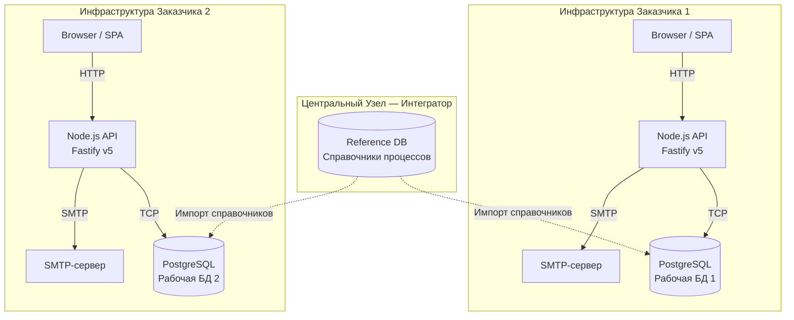

# Архитектура проекта ProcessMeter

Проект представляет собой классическое клиент-серверное веб-приложение (SPA + REST API) с реляционной БД. Монорепозиторий, разделённый на `frontend` и `backend`.

Расчётная нагрузка: до 100 одновременных пользователей, до 400 всего — Low/Medium-load. Архитектура монолитная, без преждевременной оптимизации.

## 1. Технологический стек

| Уровень | Технологии |
|---|---|
| Frontend | React 18, Vite, Vanilla CSS, `@glideapps/glide-data-grid` |
| Backend | Node.js v24+ (`"type": "module"`), Fastify v5 |
| База данных | PostgreSQL 15, нативный драйвер `pg` (параметризованные запросы, без ORM) |
| Email | Nodemailer (SMTP-настройки хранятся в таблице `settings`) |
| Auth | `@fastify/jwt` (HttpOnly cookie), `bcryptjs` |
| Rate limiting | `@fastify/rate-limit` (только публичные endpoint'ы) |
| Миграции БД | `node-pg-migrate` |
| Инфраструктура | Docker Compose |

## 2. Архитектурная схема (мультитенантность)

Развертывание on-premise на инфраструктуре заказчика. Выделяется централизованный узел (Master Data) и изолированные узлы заказчиков.



## 3. Структура директорий

```text
ProcessMeter/
├── backend/
│   ├── src/
│   │   ├── config/env.js          # Загрузка и валидация env-переменных
│   │   ├── db/
│   │   │   ├── index.js           # pg.Pool, query helper
│   │   │   └── init.js            # ensureAdminUser при старте
│   │   ├── plugins/
│   │   │   ├── auth.js            # fastify.authenticate декоратор
│   │   │   └── admin.js           # fastify.requireAdminRole декоратор
│   │   ├── routes/
│   │   │   ├── auth.js            # /api/auth/* (login, logout, me, forgot-password, set-password, token-info)
│   │   │   └── admin/
│   │   │       ├── users.js       # /api/admin/users/*
│   │   │       ├── settings.js    # /api/admin/settings (SMTP, email-шаблоны)
│   │   │       ├── processes.js
│   │   │       └── import.js
│   │   ├── services/
│   │   │   ├── tokenService.js    # Создание/валидация/удаление password_tokens
│   │   │   └── emailService.js    # SMTP-транспортер (с кешем), отправка писем
│   │   └── server.js              # Точка сборки: регистрация плагинов и роутов
│   ├── migrations/                # Направленные миграции (node-pg-migrate)
│   └── package.json
├── frontend/
│   └── src/
│       ├── App.jsx                # Корневой роутинг (login / set-password / respondent / admin)
│       ├── components/
│       │   ├── LoginPage.jsx
│       │   ├── SetPasswordPage.jsx   # Форма установки/сброса пароля по токен-ссылке
│       │   ├── admin/
│       │   │   ├── UserManagement.jsx
│       │   │   └── SettingsPage.jsx
│       │   └── RespondentView.jsx
│       └── styles.css
├── db/                            # Эталонные схемы и справочная документация
├── docs/                          # Техническая документация
└── docker-compose.yml
```

## 4. Взаимодействие компонентов

### Frontend (SPA)
- В dev-режиме: Vite (`npm run dev`, порт 5173).
- В production: собирается в `dist/`, раздаётся Fastify или Nginx.
- Состояние аутентификации — JWT в HttpOnly cookie (`pm_token`).

### Backend (Fastify API)
- Stateless-сервер; верифицирует JWT на каждый запрос.
- Пул соединений `pg.Pool` (10–20 коннектов достаточно для до 100 пользователей).
- `@fastify/rate-limit` с `global: false` — ограничения только на помеченных route'ах.

### Сервис email (`emailService.js`)
- Nodemailer-транспортер создаётся лениво и кешируется по JSON-ключу SMTP-настроек. Инвалидируется при изменении настроек.
- Шаблоны писем хранятся в `settings` и редактируются через админ-интерфейс.
- Переменные `{{name}}` в шаблонах HTML-экранируются (`escapeHtml`), кроме `{{link}}`.

### Сервис токенов (`tokenService.js`)
- Токены хранятся в таблице `password_tokens` (тип `invite` / `reset`).
- `createToken` — UPDATE + INSERT в одной транзакции (защита от race condition).
- `validateToken` — проверяет `used_at` и `expires_at` (24 ч).
- `deleteToken` — удаляет неиспользованный токен при ошибке отправки письма.

### Database (PostgreSQL)
- **`refdb`** — эталонная БД (справочники: `process_1..4`, `systems`, `executors`). В контуре интегратора.
- **`mydb`** — рабочая БД заказчика (пользователи, доступы, ответы, токены, настройки).
- Инициализация: применяются `migrations/` → `ensureAdminUser()` → администратор выдаёт права → `copy_operations_to_user_answers()`.

## 5. Архитектурные инварианты (ADR)

1. **Безопасность API**: JWT + роль проверяются на каждом защищённом endpoint через `preHandler: [fastify.authenticate, fastify.requireAdminRole]`.

2. **Fail-fast**: При `NODE_ENV=production` сервер не запустится без `JWT_SECRET` — ошибка выбрасывается в `config/env.js` до инициализации Fastify.

3. **Параметризованные SQL**: Конкатенация строк в SQL запрещена. Все переменные передаются через `$1, $2, ...`.

4. **Транзакционность**: Все многошаговые операции (создание токенов, выдача доступов, bulk-операции) выполняются через `BEGIN/COMMIT/ROLLBACK`.

5. **Rate limiting только на публичных endpoint'ах**:
   - `POST /api/auth/forgot-password` — 5 req / 15 min
   - `GET /api/auth/token-info` — 20 req / 5 min

6. **Откат токена при ошибке SMTP**: Если `sendPasswordLinkEmail` бросает исключение, токен удаляется из БД (`deleteToken`), чтобы не накапливать мёртвые записи.

7. **Миграции через `node-pg-migrate`**: Запрещено автоматическое изменение схемы «на лету». Все изменения — только через файлы в `migrations/`.

8. **Username = Email**: Поле `users.username` хранит email-адрес. При отправке любого письма адрес валидируется через `isValidEmail()` перед вызовом SMTP.
